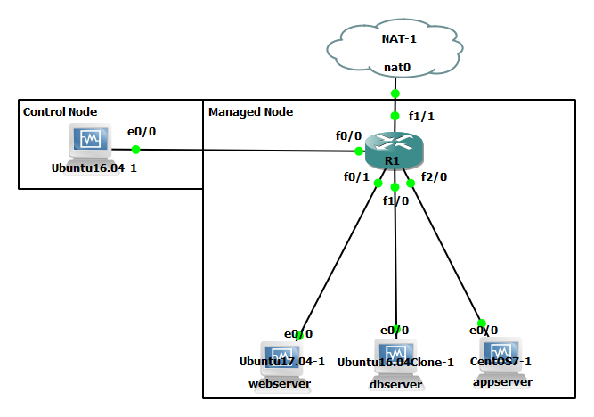

# Ansible-Simulation

  A project to simulate Ansible as the automation tool to setup, manage, 
and control any device in the praticular network 

Project type is practicing the configuration of automation tools 'Ansible' in a 
simulation environment as my own internship project. The target 
of this project is to be able to setup, manage and update
immediately as any changes occur. Its also aim to cover more proper 
procedure explanation and documentation in Bahasa Indonesia 
(and English coming soon).

The utilize software used in the simulation as follow:
- GNS3 2.16
- Virtualbox 5.1.30

The simulation run in a machine (my laptop) with spesification as follow:
- Operation System  : Windows 10
- Processor         : Intel(R) Core i3 @ 2.40 GHz
- Memory            : 8192 MB RAM

  

  <strong>Topology</strong>

